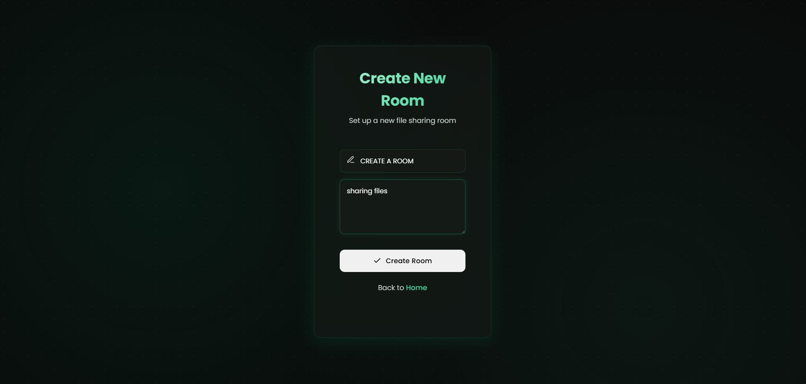
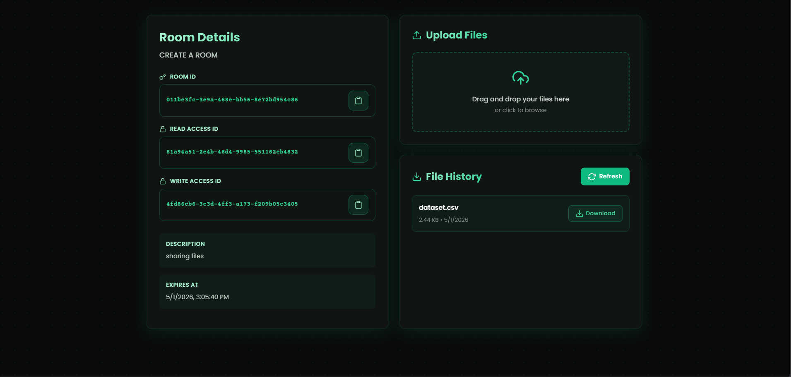
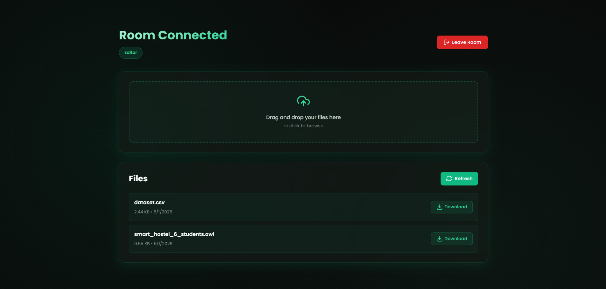
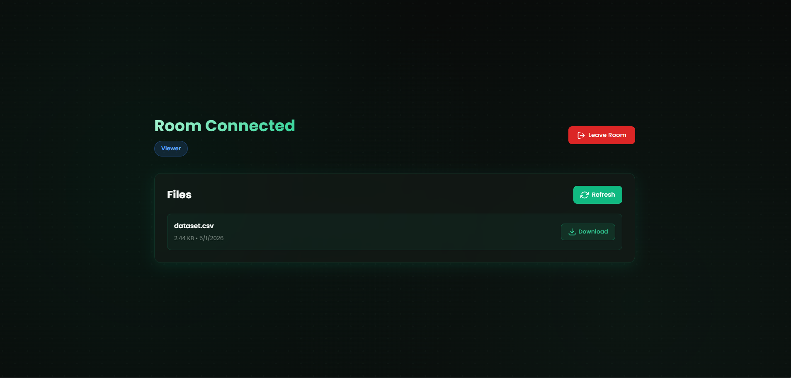

# File Sharing Project\

A role-based file sharing system that allows users to create rooms and collaborate with different access levels like Admin, Editor, and Viewer. It enables secure file management and real-time access control through a FastAPI backend and a React frontend.

### Create Room (Dashboard)



### Admin Room



### Editor Room



### Viewer Room



This project has two parts:

- `frontend` — React/Vite frontend
- `backend` — FastAPI backend

---

## 1. Backend Setup

Go to backend folder:

```bash
cd backend
```

Create Python virtual environment:

```bash
python3.12 -m venv .venv
```

Activate virtual environment:

```bash
source .venv/bin/activate
```

For Windows PowerShell:

```bash
.venv\Scripts\Activate.ps1
```

Install dependencies:

```bash
pip install --upgrade pip
pip install -r requirements.txt
```

Run backend server:

```bash
uvicorn app.main:app --reload --host 127.0.0.1 --port 8000
```

Backend will run on:

```text
http://127.0.0.1:8000
```

API docs:

```text
http://127.0.0.1:8000/docs
```

---

## 2. Frontend Setup

Open a new terminal and go to frontend folder:

```bash
cd frontend
```

Create `.env` file:

```env
VITE_API_BASE_URL=http://127.0.0.1:8000
```

Do not add a trailing slash `/`.

Install dependencies:

```bash
npm install
```

Run frontend locally:

```bash
npm run dev
```

Frontend will usually run on:

```text
http://localhost:5173
```

---

## 3. Build Frontend Locally

To create production build:

```bash
npm run build
```

This creates:

```text
dist/
```

Preview production build locally:

```bash
npm run preview
```

---

## Common Issues

### Frontend calling wrong backend URL

Check `.env`:

```env
VITE_API_BASE_URL=http://127.0.0.1:8000
```

Then restart frontend:

```bash
npm run dev
```

### Backend route not found

Open:

```text
http://127.0.0.1:8000/docs
```

Check the correct API endpoint.

### Python packages not found

Make sure venv is activated:

```bash
source .venv/bin/activate
```

Then reinstall:

```bash
pip install -r requirements.txt
```

---

## Final Local Run Order

Terminal 1:

```bash
cd backend
source .venv/bin/activate
uvicorn app.main:app --reload --host 127.0.0.1 --port 8000
```

Terminal 2:

```bash
cd frontend
npm install
npm run dev
```
